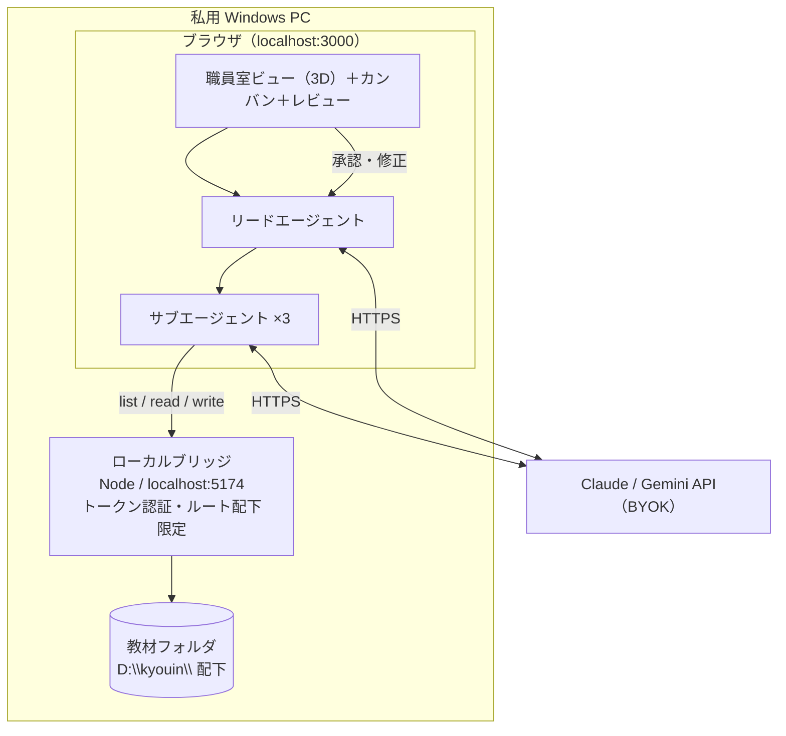

# 教員向け「エージェント職員室」実現可能性設計

> 参照アーキテクチャ: [munder-difflin](https://github.com/chaitanyagiri/munder-difflin)（Electron 上で端末エージェント CLI を束ねるマルチエージェント・ハーネス）
> 実装ベース: 本リポジトリ `kyouin-daikou-black`（The Delegation 派生。ブラウザ／React／Three.js WebGPU／BYOK）
> **前提: 私用の Windows PC で、教員本人が一人で使う。児童生徒の個人情報は入力しない。**
> **対象: 特別支援学級（全学年・全教科／重点は算数・国語・自立活動）**
> 位置づけ: 実装前の設計提案。コードはまだ変更していません。

---

## 0. 要約

前提が「学校端末・個人情報あり」から「**私用 Windows PC・個人情報なし**」に変わったことで、設計の難所が入れ替わりました。

- **消えた課題**: インストール制限、WebGPU 非対応端末、個人情報の仮名化パイプライン、学校ゲートウェイによる鍵の集中管理。いずれも不要になります。
- **残る課題**: 教員に可処分時間がないこと。費用が自腹であること。
- **新たに前面に出る課題**: **成果物がファイルであること**。指導案も、ワークシートも、行事要項も、最後は `.md` / `.docx` / 印刷物としてフォルダに残るものです。ところが現状のブラウザアプリは**ファイルを一切読み書きできません**（成果物はコピー＆ペーストで取り出すしかなく、前回の続きも覚えていません）。

したがって提案の中心は次の一点になります。

> **既存のブラウザアプリに「ローカルブリッジ」（自分の PC で動く小さな常駐プロセス）を足し、指定した教材フォルダを読み書きできるようにする。**

これだけで、単発の文章生成ツールが「学期をまたいで教材を育てる作業場」に変わります。個人情報を扱わない以上、安全機構は最小限（フォルダの外に出ない・localhost に閉じる）で足ります。

---

## 1. 前提が変わって、設計はどう変わるか

| 前提 | 旧設計（学校端末・個人情報あり） | 新設計（私用 PC・個人情報なし） |
|---|---|---|
| 端末とインストール | ブラウザ必須、Electron・CLI 不可 | **制約なし**。Node も CLI も入る |
| 3D 職員室（WebGPU） | 非対応端末があるため必須要件から除外 | **既定で有効**。Windows + Chrome/Edge なら動く |
| 個人情報 | 仮名化パイプライン（実装規模 L）が必須 | **不要**。入力しない前提。代わりに入力時の注意喚起だけ残す |
| API キー | 学校ゲートウェイで集中管理、端末に置かない | **BYOK のままでよい**。自分の PC の自分の鍵 |
| 承認（HITL） | 出力種別ごとに強制 | **緩めてよい**。ただし「AI の下書きをそのまま配らない」運用は維持 |
| 監査ログ | 誰がいつ承認したかの記録が必須 | **不要**。代わりに「どのプロンプトでこれができたか」の再現用ログがあると便利 |
| ファイル入出力 | 端末内 IndexedDB に閉じる想定 | **最重要機能に昇格**。教材フォルダを直接読み書きする |

**残る制約**は 2 つだけです。

- **R1 時間**: 教員が触れるのは空きコマの数分。ノードエディタで設計する時間はない。既定 UI は「テンプレを選ぶ → 3 行書く → 出てきたものを直す」。
- **R2 費用が自腹**: 使った分だけ課金される。月の上限とモデルの使い分けを最初から設計に入れる（§7）。

**新しく効いてくる制約**は 3 つです。

- **R3 成果物はファイル**: コピペ運用では蓄積しない。フォルダ構造とファイル命名まで含めて設計する（§5）。
- **R4 バックアップと再現性は自分持ち**: 学校の情報担当は助けてくれない。教材フォルダを git 管理するか、クラウド同期フォルダに置くかを最初に決める。
- **R5 法務は私用 PC でも変わらない**: 教科書・市販ワークの本文を丸ごと投入することは、著作権法 35 条の範囲を超えうる（私用 PC かどうかは無関係）。また、個人情報でなくとも「校務文書の持ち出し」に関する規程がある自治体があるため、学級通信や行事要項の下書きを私用 PC に置いてよいかは一度確認しておくのが安全です。

---

## 2. 4 つの選択肢と推奨

| | 方式 | 得られるもの | 手間 | 判定 |
|---|---|---|---|---|
| **A** | 既存ブラウザアプリのまま（BYOK・`localStorage`） | 今すぐ使える。3D 職員室も動く | ゼロ | 単発の文章生成には十分。**ファイルが扱えない**のが致命的 |
| **B** | **既存アプリ ＋ ローカルブリッジ** | ファイル読み書き・記憶の永続化・書き出し。UI 資産をすべて維持 | **小〜中**（新規 200〜300 行程度＋ツール 3 本） | **推奨。本体はこれ** |
| **C** | munder-difflin を Windows でそのまま使う | 完成済みの多エージェント基盤、長期記憶、放置して働かせられる | 中（Node・C++ ツールチェーン・CLI エージェントの契約） | **併用推奨**。重量級の一括作業の外注先として |
| **D** | Electron / Tauri へ完全移行 | 単一アプリとして配布可能 | 大 | 将来の選択肢。今やる必要はない |

### なぜ B が本命か

本リポジトリには既に、リードエージェント＋サブエージェント、カンバン、レビュー・差し戻しモーダル、コスト表示、3D 職員室が動く形で揃っています。足りないのは**ファイルに触れる手**の一点だけです。ブラウザの制約は「サーバがないこと」であって、自分の PC でサーバを 1 つ立てれば消えます。

### なぜ C を併用するか

munder-difflin は「エージェントを放っておくと働き続ける」ことに最適化されています（メールボックス、長期記憶、統括エージェント）。これは **年間指導計画の一括見直し**や**過去 3 年分の教材の棚卸し**のような、時間はかかるが目を離してよい作業に向きます。一方、5 分で 1 枚のワークシートを作りたいときには重すぎます。**軽い前者を B、重い後者を C** と割り切るのが現実的です。

> C を試す場合の Windows 側の準備: Node.js 18+、`node-pty` のビルドに必要な C/C++ ツールチェーン、`claude` などのエージェント CLI が 1 つ。v0.4.4 で Windows のエージェント間通信の不具合が修正されているため、それ以降を使うこと。

---

## 3. 推奨アーキテクチャ



要点は 3 つです。

1. **LLM への通信はブラウザから直接**（現状のまま）。ブリッジは LLM を中継しない ＝ 鍵はブリッジに渡さない。
2. **ブリッジはファイル専用**。教材フォルダのルート配下しか見えない。
3. **ブリッジが落ちていてもアプリは動く**（ファイル機能だけ無効になる）。導入の心理的コストを下げるための設計です。

---

## 4. ローカルブリッジの仕様

### 起動

```powershell
npm run bridge -- --root "D:\kyouin"
# → http://localhost:5174 で待ち受け、起動時にワンタイムトークンを表示
#   （そのトークンをアプリの設定に一度貼れば、以降は localStorage に保存）
```

### API

| メソッド | パス | 用途 |
|---|---|---|
| `GET` | `/files?dir=01_授業/理科` | フォルダ一覧（ルート配下のみ） |
| `GET` | `/file?path=…` | ファイル読み取り |
| `PUT` | `/file?path=…` | ファイル書き込み（既存ファイルは `.bak` を残す） |
| `GET` `PUT` | `/memory` | エージェントの長期記憶（`99_記憶/memory.md`） |
| `POST` | `/export` | Markdown → 印刷用 HTML / `.docx` 変換 |

### 安全側の作り（個人情報を扱わなくても、事故を防ぐために必要な最小限）

- `127.0.0.1` にのみバインド（LAN に晒さない）
- 起動時に生成したトークンを `Authorization` ヘッダで要求
- 受け取ったパスは `path.resolve` してから**ルート配下であることを検証**（`..` によるパストラバーサルを遮断）
- 拡張子ホワイトリスト（`.md .txt .csv .json .html`）。実行可能ファイルは読み書きしない
- 削除 API は**作らない**（消す操作は人間がエクスプローラでやる）

### エージェント側に増やすツール

`src/core/agent/ToolRegistry.ts` に 3 つ追加するだけで、エージェントがフォルダを扱えるようになります。

| ツール | 用途 |
|---|---|
| `list_files(dir)` | 「去年の単元計画を見て」に対応する |
| `read_file(path)` | 学校要覧・年間計画・書式テンプレを参照する |
| `write_file(path, content)` | 成果物をフォルダに直接保存する |

既存の `complete_task` / `deliver_project` は、出力を**画面に返すと同時にファイルへ保存する**よう拡張します。

---

## 5. 教材フォルダの設計

ここを先に決めておかないと、エージェントは毎回ゼロから作文します。フォルダ構造そのものが、実質的にエージェントへの指示になります。特別支援学級では、通常学級と置くものが変わります。

```
D:\kyouin\
  00_共通\
    学級の実態.md          … ★最重要。匿名ID（A児〜F児）ごとの実態
    自立活動_区分項目.md    … 6区分27項目の一次資料（告示本文をコピー）
    年間指導計画\
    書式\               … 個別の指導計画・連絡帳・おたよりの雛形
  01_教材\
    国語\  算数\  自立活動\   … 難易度別に溜まっていく資産
  02_個別\A児\ B児\ …        … 匿名IDのみ。氏名との対応表は置かない
  03_印刷テンプレート\        … マス目・なぞり書き・分かち書き・1課題1ページ
  99_記憶\
    memory.md            … 差し戻しの指摘が溜まる
```

**`学級の実態.md` が土台です。** 氏名は書かず、A 児・B 児という記号だけで運用します。氏名との対応表はこのフォルダの**外**（紙か別の場所）に置きます。こうしておけば、実態の記述をエージェントに渡しても個人情報の入力になりません。児童が変わったら、このファイルを書き換えるだけで `01_教材` の資産は再利用できます。

**`03_印刷テンプレート` は特支では機能そのものです。** マス目原稿用紙、なぞり書き（薄いグレー）、分かち書き（文節間スペース・行間 2.0）、1 課題 1 ページ、そして **BIZ UDPゴシック**（Windows 標準搭載の UD フォント）指定を CSS で用意しておくと、書き出しの実用度が一段変わります。

## 6. エージェント編成とモデルの割り当て

特別支援学級の中心的な負担は「1 コマの中で児童ごとに違う教材が要る」ことです。したがって主力チームは、**1 つの題材から難易度違いを同時に作る**構成にします。既存の型（リード 1 ＋ サブ最大 3、`MAX_AGENTS = 5`）にそのまま収まります。

| # | チーム | リード | サブエージェント | 主な成果物 |
|---|---|---|---|---|
| 1 | **授業準備室（同時異教材）** | 授業デザイナー | **教材A（下位）／教材B（中位）／教材C（上位）** | 同一題材・3 段階のプリント＋本時案 |
| 2 | 国語教材室 | 読み書き支援 | 本文リライト（分かち書き・ルビ）／設問作成／視覚支援設計 | 読み教材の 3 段階版・設問・場面絵の指示 |
| 3 | 算数教材室 | 数概念 | スモールステップ分解／具体物・半具体物の提示案／練習問題の型 | 段階分解表・操作活動案・**ドリルの型** |
| 4 | 自立活動室 | 自立活動担当 | 区分項目の紐づけ／活動案／記録様式 | 学期分の活動計画・1 分で書ける記録様式 |
| 5 | 記録・計画室 | 計画担当 | 目標文案／評価文案／連絡文案 | 個別の指導計画の**下書き**（匿名 ID のまま） |

チーム 1 が主力です。サブ 3 人が**難易度別に並行する**構成にしているのがポイントで、これは通常学級向けの「役割分担」より特支の実務に直接効きます。

チーム 4 は `00_共通/自立活動_区分項目.md` の記述からのみ引用するようプロンプトで縛ります（区分名を記憶から書かせると項目がずれるため）。

### モデルの割り当て（コストと品質の両立）

`src/core/llm/constants.ts` は既にモデル別指定に対応しています（`AgentNode.model`）。

| 役割 | モデル | 理由 |
|---|---|---|
| リード（設計・統合） | `claude-opus-5` または `claude-sonnet-5` | 構成を決める部分だけ賢いモデルを使う |
| サブ（作文・整形・チェック） | `claude-haiku-4-5` | 分量が出る作業。ここを安いモデルにすると効く |
| 画像が要るとき | Gemini（`outputType: 'image'`） | 既存のまま |

参考価格（100 万トークンあたり、Anthropic 直接利用）: Opus 5 = 入力 $5 / 出力 $25、Sonnet 5 = $3 / $15（2026-08-31 まで導入価格 $2 / $10）、Haiku 4.5 = $1 / $5。

---

## 7. 費用の見積もりと抑え方

**1 件あたりの目安**: 1 つの題材から 3 段階のプリント＋本時案を 4 エージェントで作る場合、履歴の再送を含めて入力 8〜10 万トークン、出力 1.5 万トークン前後。

- リード Sonnet 5 ＋ サブ Haiku 4.5 → **70〜90 円**（1 ドル 150 円換算）
- 月 30 授業で **2,000〜3,000 円**程度

**計算ドリルの数値違いを LLM に量産させない**（§8-12）だけで、ここからさらに下がります。

抑え方は 3 つあります。

1. **モデルの使い分け**（上表）。作文量の多いサブを Haiku にするのが最も効きます。
2. **プロンプトキャッシュ**。`00_共通` の学校要覧や書式は毎回同じ内容が前置きされるため、`cache_control` を付ければキャッシュ部分は約 1/10 の課金で済みます（`ClaudeProvider` に数行の追加）。
3. **月次上限**。`src/core/llm/pricing.ts` が既にトークンとコストを計算しているので、累計を保存して閾値で警告・停止する仕組みを足します（R2 への直接の回答）。

---

## 8. 既存コードへの実装マッピング

実装状況は 2026-08-22 時点（ブランチ `claude/teacher-focused-design-kv19k9` / PR #1）。

| # | やること | 対象 | 状況 |
|---|---|---|---|
| 1 | 特支向けチームの定義 | `src/data/teacherAgents.ts` → `AGENTIC_SETS` に合流 | **済**（4チーム。同時異教材室が主力） |
| 2 | 日本語固定・特支の文脈のシステムプロンプト | `src/core/agent/PromptBuilder.ts` | **済**（`teamType === '特別支援'` のときだけ。S1〜S10） |
| 3 | ローカルブリッジ（ルート配下限定・トークン認証） | `bridge/server.mjs`＋`npm run bridge` | **済** |
| 4 | ファイル系ツール 3 本 | `src/core/agent/tools/fileTools.ts`＋`ToolRegistry.ts` | **済**（read は全フェーズ、write は working のみ） |
| 5 | 成果物のファイル保存 | `write_file`（`printTemplate` 指定で HTML も同時） | **済**（エージェントが保存する。S9 で明示） |
| 6 | 長期記憶（`99_記憶/memory.md`） | `bridge/memory.mjs`＋`PromptBuilder` | **済**（差し戻しの指摘を追記し、毎回プロンプトに載せる） |
| 7 | 月次コスト上限と警告 | `pricing.ts`＋`coreStore` | 未着手 |
| 8 | プロンプトキャッシュ対応 | `ClaudeProvider.ts` | 未着手 |
| 9 | 印刷用 HTML 書き出し | ブリッジ `/export`＋`bridge/markdown.mjs` | **済**（`.docx` は未対応。HTML から印刷する運用） |
| 10 | 個人情報の入力に対する注意喚起 | プロンプト S1（成果物に氏名を書かない） | 部分的（UI の但し書きは未着手） |
| 11 | ブリッジ未起動時のフォールバック | `ToolRegistry.getDefinitions` | **済**（ツール定義自体を出さない） |
| 12 | ドリル生成（型を渡すと決定的に量産） | `bridge/drill.mjs`＋`POST /generate/drill` | **済**（`npm test` で 11 件） |
| 13 | 印刷テンプレート | `bridge/templates.mjs`＋`03_印刷テンプレート/*.css` | **済**（フォルダ側の CSS が優先） |

**12 は設計上の線引きです。** 文章・構成・段階づけは LLM、数値の量産と正誤は決定的なコード。反復練習の分量が多い特支では、ここを分けないと「遅い・高い・答えを間違える」の三重苦になります。

旧設計にあった PII ガード（規模 L）と学校ゲートウェイ（規模 M）は、前提が変わったため**削除**しました。WebGPU フォールバックも必須項目から外しています（保険として安価に入れる余地はあります）。

### 図（決定的に描く）

反復ドリルと同じ線引きを図にも適用する。**どの図をどの数で出すかはエージェントが決め、
実際に描くのはコード**（`bridge/figures.mjs`）。生成モデルに絵を描かせると、
「7個」と書いてある横に6個描く、水位が量と合わない、といった事故が起きる。
特別支援では図が本文より先に読まれるので、ここが狂うと教材にならない。

教材の Markdown には次の形で入る。Markdown のままなら指示として読め、
印刷用 HTML に変換した時点で SVG の図になる。

    ```図
    type: container
    total: 10
    filled: 3
    ```

| 種類 | 指示 | 用途 |
|---|---|---|
| `tenframe` | count | 十マス。合成分解、あといくつで10 |
| `dots` | count, cols, shape | 具体物の代わり。数える |
| `numberline` | min, max, step, marks, blanks | 数直線。blanks は空欄の四角 |
| `container` | total, filled, unit | かさ。目もりの数で指定（1L=10dL） |
| `clock` | hour, minute | 時計 |
| `tape` | parts, labels, total | テープ図。parts は比 |
| `fraction` | numerator, denominator, shape | 分数（帯・円） |
| `coins` | values | お金。実在する額面のみ |
| `grid` | rows, cols | 方眼。筆算の桁そろえ、作図 |

白黒・太線で描く。色に意味を持たせない（白黒印刷で消えるため）。
指示が誤っているとき（入れ物より多い水、分母を超える分子、実在しない硬貨）は、
黙って描かず、赤い枠の注記にして直す場所が分かるようにする。

## 実装中に分かったこと

- **既存の 100 語制限がそのままでは成立しない**：`PromptBuilder` の規約に「systemic output は 100 語以内」があり、ワークシート本文が収まりませんでした。特支チームのみ本文の制限を外しています（タスクのタイトル・説明の制限は維持）。
- **ツールの戻り値が真偽値だけでは足りない**：`ToolRegistry.process` は成否しか返せず、ファイルの中身をエージェントに渡せませんでした。文字列も返せるようにし、`AgentBrain` が `tool_result` としてそのまま渡します。
- **既定チームが実在しないチームを指していた**：`DEFAULT_AGENTIC_SET_ID` が `'single-agent'` で、常に `AGENTIC_SETS[0]` にフォールバックしていました。
- **アバターの配置が固定数で割られていた**：`NpcAgentDriver` の円状配置が `MAX_AGENTS`（5）分割だったため、6 人目以降が 1〜4 人目に重なっていました。実際のアバター数で割るよう修正。

---

## 9. 段階導入

| フェーズ | 期間目安 | 内容 | この時点でできること |
|---|---|---|---|
| **P0** | 済 | 実装 1・2 | ブラウザで 3 段階の教材が作れる（コピペ運用） |
| **P1** | 済 | 実装 3・4・5・11・13 | 教材フォルダに直接保存。去年の教材を読ませて改訂できる |
| **P2** | 済（7・8 を除く） | 実装 6・9・12 | 学級の約束を記憶し、印刷用に書き出せる。ドリルは決定的に量産 |
| **次** | — | **実地確認** | 実際に 1 回動かし、出力の質を見る。ここから先は使ってみないと決められない |
| **P3** | 必要になったら | munder-difflin を Windows に導入（選択肢 C） | 年間計画の一括見直しなど、放置して回す重い作業 |

P1 まで到達すれば、実務で使う道具としては十分に成立します。

---

## 10. 残るリスク

- **自立活動の区分・項目**: 記憶から書かせると区分名や項目番号がずれます。告示本文を `00_共通/自立活動_区分項目.md` に置き、そこからのみ引用させます（実装 2）。
- **匿名 ID 運用の徹底**: 氏名との対応表を教材フォルダに置かない限り、実態の記述は個人情報の入力になりません。逆に、対応表を 1 つ置いた瞬間に前提が崩れます。
- **ハルシネーション**: 指導要領の記述や統計を勝手に作ることがあります。`00_共通` に一次資料を置いて**参照させる**のが最も効く対策で、「出典のない断定を書かない」をシステムプロンプトに入れます（実装 2）。
- **著作権（R5）**: 教科書・市販教材の本文投入は避ける。参照するなら書誌情報と単元名まで。
- **校務文書の持ち出し（R5）**: 個人情報でなくとも規程がある場合があるため、一度確認を。
- **バックアップ（R4）**: 教材フォルダを git 管理するか、OneDrive 等の同期下に置く。ブリッジは `.bak` を残しますが、バックアップの代わりにはなりません。
- **依存の固定化**: 生成物をそのまま配らない運用は、個人情報の有無と関係なく維持する価値があります（誤りは教員の責任として返ってくるため）。

---

## 11. 前提変更にともなう判断の整理

**破棄した判断**

- 仮名化パイプライン、データ A/B/C 分類、型による送信禁止 — 個人情報を扱わないため不要
- 学校／自治体ゲートウェイによる鍵の集中管理 — 自分の鍵を自分の PC で使うため不要
- WebGPU 非対応を前提とした 2D／リストのフォールバック必須化 — 私用 PC では 3D が動く
- 出力種別ごとの承認強制と監査ログ — 一人運用のため、運用ルールで足りる

**維持した判断**

- Electron 版のフル移植はしない（選択肢 D は将来）— 既存のブラウザ資産を捨てる理由がない
- 既定 UI は 3 ステップ、ノードエディタは奥に隠す — R1（時間）は前提が変わっても消えない
- 教員向け 5 チーム構成 — フォルダ読み取りを前提とする「教材リフォーム室」を追加して強化
- 生成物は下書きとして扱う — 責任の所在は変わらない

---

## 付録：セキュリティ上の注意（本タスクの入力について）

本設計の依頼に添えられた URL には `mcp_token` がクエリ文字列として含まれていました。**このトークンは使用していません**（対象リポジトリは公開リポジトリのため、匿名 clone のみで参照しました）。トークンは平文でチャット・ログ・ブラウザ履歴に残るため、**失効・再発行を推奨します**。
