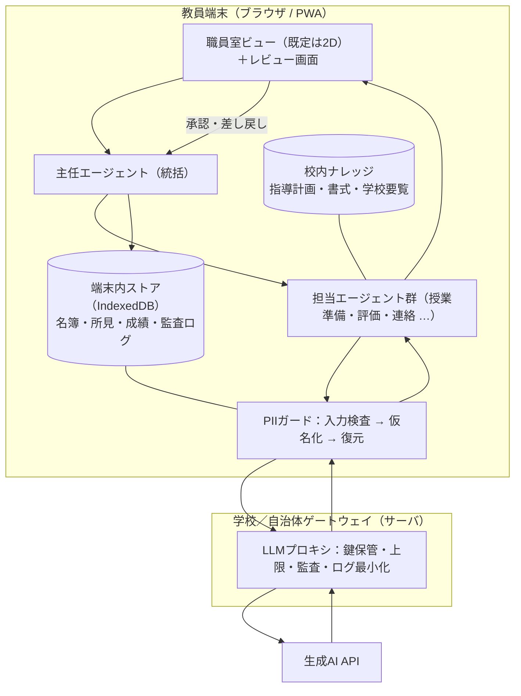

# 教員向け「エージェント職員室」実現可能性設計

> 参照アーキテクチャ: [munder-difflin](https://github.com/chaitanyagiri/munder-difflin)（Electron 上で端末エージェント CLI を束ねるマルチエージェント・ハーネス）
> 実装ベース: 本リポジトリ `kyouin-daikou-black`（The Delegation 派生。ブラウザ／React／Three.js WebGPU／BYOK）
> 位置づけ: 実装前の設計提案。コードはまだ変更していません。

---

## 0. 要約

munder-difflin の中核は **「役割を持った複数エージェント＋共有記憶（hive）＋統括エージェント（GOD）＋人間の承認ゲート」** という調整レイヤーであり、これは教員業務にそのまま効きます。一方で **Electron・端末 CLI・ローカル git・PTY** という実装形態は、学校端末では現実的に動きません（管理者権限なし・アプリ導入不可）。

したがって提案は次の一点に集約されます。

> **munder-difflin の「調整レイヤーの設計」だけを取り出し、本リポジトリが既に持つブラウザ実装（リードエージェント＋サブエージェント＋カンバン＋Human-in-the-loop 承認）の上に、教員版として再実装する。**

そのために必要な追加要素は 4 つだけです。

1. **個人情報ガード**（送信前の仮名化と、そもそも送らせない入力ゲート）
2. **鍵とコストの学校側集中管理**（BYOK を教員に持たせない）
3. **軽量表示モード**（WebGPU 非対応端末でも起動する 2D／リスト表示）
4. **教員業務テンプレ 5 チーム**（授業準備・テスト・保護者連絡・記録下書き・校務事務）

---

## 1. 参照元と手持ち資産の対応関係

| munder-difflin の要素 | 実体 | 教員版での扱い |
|---|---|---|
| 端末 CLI をエージェント化（node-pty / xterm.js） | ローカルプロセス | **不採用**（学校端末に CLI もアプリも入らない） |
| hive（per-agent memory / inbox・outbox / blackboard / log.jsonl / 単一コミッタ git） | ローカル git リポジトリ | **縮退採用**：ブラウザ内キュー＋IndexedDB＋監査ログに置換 |
| GOD エージェント（Michael）＝統括・裁定・エスカレーション | 特権エージェント | **採用**：「主任エージェント」として既存のリードエージェント（index 1）を拡張 |
| Human gates（費用・破壊的操作・スコープ変更を人間に上げる） | 承認 | **最重要採用**：教員版では *ほぼ全出力* が承認対象 |
| Kanban／依存関係つきタスク台帳 | Command Center | **既にある**（`coreStore` のタスク＋`KanbanPanel`） |
| 2D オフィス床（Pixi.js アバター） | 可視化 | **採用（ただし軽量化）**：本リポジトリは 3D／WebGPU なので 2D フォールバックを追加 |
| Circuit breaker（暴走・予算超過の steer→constrain→stop） | 安全装置 | **採用（簡易版）**：ターン上限・トークン上限・コスト上限 |
| Slack / webhook 連携、Skills カタログ、Monaco IDE | 開発者向け | **不採用**（教員には不要。UI 負債になる） |

本リポジトリ側で **すでに動いている** 資産（再利用可能）:

- `src/data/agents.ts` — `AGENTIC_SETS`：チーム定義（リード＋サブエージェント、`humanInTheLoop`、`outputType`）
- `src/core/agent/AgentBrain.ts` / `PromptBuilder.ts` / `ToolRegistry.ts` — エージェントループとツール（`set_user_brief` / `propose_task` / `complete_task` / `deliver_project`）
- `src/integration/store/coreStore.ts` — タスク台帳・アクションログ・成果物、`localStorage` 永続化
- `src/interface/OutputReviewModal.tsx` / `AuditModal.tsx` — 承認・差し戻し UI（＝教員のレビュー動線がすでにある）
- `src/core/llm/providers/*` — Gemini / Claude プロバイダ、`pricing.ts` によるコスト表示
- `.github/workflows/deploy.yml` — GitHub Pages への静的配信（**インストール不要で配れる**＝学校での最大の強み）

---

## 2. 学校で「実現可能」を決める 5 つの制約

設計判断はすべてここから導出しています。

### C1. 端末制約 — インストールできない／WebGPU が無い
校務用 PC・Chromebook は管理者権限が無く、Electron アプリも CLI も導入できません。さらに本リポジトリの `src/simulation/core/Engine.ts` は `THREE.WebGPURenderer` 固定で、初期化失敗時も `console.error` するだけです（＝黒画面）。
→ **配信形態はブラウザ（静的ホスティング／PWA）一択。3D は必須要件から外す。**

### C2. 個人情報 — 生徒の氏名・成績・所見は外部送信できない
自治体の情報セキュリティポリシーと生成 AI 利用ガイドラインの下では、児童生徒の個人情報を外部 API に送る運用は原則通りません。
→ **端末内に閉じる領域と、送信してよい領域を型で分離する。**

### C3. 説明責任 — 評価・成績・所見を AI が決めてはいけない
最終責任は教員にあります。AI 生成物は「下書き」であり、教員の確認と修正を経てはじめて成果物になります。
→ **HITL は設定項目ではなく、出力種別ごとの強制。加えて「誰がいつ何を承認したか」の監査ログ。**

### C4. 鍵と費用 — BYOK は教員に運用できない
現状は `BYOKModal` が API キーを `localStorage` に保存し、`ClaudeProvider` が `dangerouslyAllowBrowser: true` でブラウザから直接叩く構成です。個人の鍵を各教員に配る／各自で取得させるのは、費用・管理・漏洩リスクのどれから見ても破綻します。
→ **学校側にゲートウェイを置き、鍵は教員端末に置かない。**

### C5. 時間 — 教員が触れるのは「空きコマの 5 分」
ノードエディタでマルチエージェント設計をする時間はありません。
→ **既定 UI は「テンプレを選ぶ → 3 行書く → 承認する」の 3 ステップ。`VisualConfigurator` は管理者モードに隔離。**

---

## 3. 提案アーキテクチャ



### 3.1 データを 3 分類し、型で強制する

| 区分 | 例 | 保存先 | 外部送信 |
|---|---|---|---|
| **A：個人情報** | 児童生徒氏名・成績・所見・出欠・家庭状況 | 端末内 IndexedDB のみ | **禁止**（型レベルで `SensitiveText` を送信関数に渡せなくする） |
| **B：準機微** | 匿名化済みの学級傾向、「S1 は計算の手順で躓く」 | 端末内 ＋ 仮名化して送信可 | 仮名化後のみ可 |
| **C：非個人情報** | 単元名・指導案・ワークシート・おたよりの雛形 | 通常 | 可 |

実装は「`piiGuard.sanitize()` を通した戻り値の型でしか LLM 呼び出しができない」構造にします。運用ルールではなくコンパイルエラーで守るのがポイントです。

### 3.2 仮名化パイプライン

1. 名簿は端末内で `S1, S2, …` の学級内 ID に写像（写像テーブルは端末を出ない）
2. 送信前に本文中の氏名・住所・電話番号・学籍番号を検出して置換（名簿一致＋正規表現＋数字列ヒューリスティック）
3. 応答受信後、端末内で ID を実名に復元して表示
4. 検出漏れの疑いがある入力（未知の人名らしき語）は **ブロックして教員に確認を求める**（誤検知は「送らない側」に倒す）

### 3.3 hive のブラウザ縮退版

munder-difflin は多プロセス前提なので git・atomic rename・単一コミッタが必要でしたが、ブラウザは単一スレッドなのでそのまま簡略化できます。

| hive | 教員版 |
|---|---|
| `agents/<id>/inbox` `outbox` ＋ router | Zustand ストア上のメッセージキュー（`hops` 上限と冪等 ID の考え方はそのまま流用） |
| `memory.md`（エージェント長期記憶） | エージェントごとの `memory` レコード（IndexedDB）。学期をまたいで「この学級はこう」を保持 |
| `board.md`（共有黒板・単一書記） | 「単元ボード」：主任エージェントのみが書き込む共有計画 |
| `log.jsonl`（追記専用イベントログ） | 監査ログ：`{時刻, 操作, エージェント, 入力ハッシュ, 承認者, 出力ID}` を追記のみ。CSV/JSON でエクスポート可 |
| 単一コミッタ git | 不要（単一スレッド）。バックアップは手動エクスポート |

### 3.4 表示モードは 3 段階

| モード | 要件 | 用途 |
|---|---|---|
| **リスト**（既定） | DOM のみ | 低スペック端末・急いでいる時。カンバンと承認だけ |
| **2D 職員室** | Canvas 2D | 進行状況の直感的把握。munder-difflin の床ビュー相当 |
| **3D 職員室** | WebGPU 対応時のみ | 研修・広報・生徒への説明用 |

`Engine.init()` に機能検出を入れ、未対応なら 3D を出さずリストへフォールバックします（現状は黒画面になります）。

---

## 4. エージェント編成（`AGENTIC_SETS` に追加するチーム）

既存の型（リード 1 ＋ サブ最大 3、`MAX_AGENTS = 5`）にそのまま収まる構成にしてあります。全チーム `outputType: 'text'`、リードは `humanInTheLoop: true`。

| # | チーム | リード | サブエージェント | 成果物 | 承認 |
|---|---|---|---|---|---|
| 1 | **授業準備室** | 単元デザイナー | 教材作成／発問設計／評価規準作成 | 単元計画・本時案・ワークシート・ルーブリック | 教員承認 |
| 2 | **評価サポート室** | 評価主任 | 問題作成／解答解説／観点別整理 | 小テスト・解説・観点別集計の下書き | **必須**（評定確定は人間のみ） |
| 3 | **連絡・おたより室** | 広報担当 | 文面作成／読みやすさ校正／配慮チェック | 学級通信・保護者向け文書・行事案内 | **必須**（送信前に必ず教員） |
| 4 | **記録下書き室** | 記録担当 | 所見下書き／表現バリエーション／表現チェック | 所見・面談メモの**下書きのみ** | **必須**＋仮名化強制 |
| 5 | **校務事務室** | 事務調整 | 様式作成／集計整理／日程調整 | 行事要項・アンケート設問・部活動計画 | 教員承認 |

**チーム 4 の特別扱い**：所見系は入力に個人情報が混ざる前提の唯一のチームなので、
- 入力は名簿 ID ＋ 匿名化済み観察メモに限定
- 出力は必ず「下書き」ラベル付きで、コピー時に警告
- 断定的評価語・比較表現（「〜に劣る」等）を出力ゲートで検出して差し戻し

---

## 5. 既存コードへの実装マッピング

| # | やること | 対象 | 規模 |
|---|---|---|---|
| 1 | 教員向けチーム定義を追加 | `src/data/teacherAgents.ts`（新規）→ `AGENTIC_SETS` に合流 | S |
| 2 | 日本語固定・教育文脈のシステムプロンプト（禁止事項、出典明示、学習指導要領の観点） | `src/core/agent/PromptBuilder.ts` | S |
| 3 | PII ガード（検出・仮名化・復元・型による送信禁止） | `src/core/privacy/piiGuard.ts`（新規）＋ `AgentBrain` の呼び出し口 | **L** |
| 4 | 学校ゲートウェイ用プロバイダ（鍵をクライアントに置かない） | `src/core/llm/providers/SchoolProxyProvider.ts`（新規） | M |
| 5 | 出力ゲート（承認必須種別、断定評価語の検出、下書きラベル） | `src/core/agent/tools/completeTask.ts` / `deliverProject.ts` | M |
| 6 | 監査ログの拡張とエクスポート | `src/integration/store/coreStore.ts`（`actionLog`）＋ `AuditModal` | M |
| 7 | WebGPU 機能検出と 2D／リストのフォールバック | `src/simulation/core/Engine.ts` / `SimulationView.tsx` | M |
| 8 | 簡易 UI（テンプレ選択 → ブリーフ → 承認の 3 ステップ）と管理者モード分離 | `src/interface/school/*`（新規）／`VisualConfigurator` を隠す | M |
| 9 | 校内ナレッジ（年間指導計画・書式・学校要覧）の取り込みと全文検索 | `src/core/knowledge/*`（新規、まずは静的 JSON ＋ 前方一致検索で十分） | M |
| 10 | 書き出し（印刷用 HTML → PDF、Word 貼り付け向けの整形） | `src/interface/FinalOutputModal.tsx` 拡張 | S |
| 11 | ターン上限・コスト上限（簡易サーキットブレーカ） | `AgentBrain` ＋ `pricing.ts` | S |
| 12 | 端末内ストア（名簿・記録・監査）を `localStorage` から IndexedDB へ | `coreStore` の永続化層 | M |

**着手順の推奨**：1 → 2 → 7 →（ここまでで校内デモ可）→ 4 → 3 → 5 → 6。
つまり **「まず非個人情報だけで動かして見せ、個人情報を扱う前にガードとゲートウェイを入れる」** 順序です。

---

## 6. 安全設計：4 つのゲート

```
入力ゲート          モデルゲート        出力ゲート          記録ゲート
個人情報検出        送信先の固定        承認必須の判定      監査ログ追記
禁止語ブロック  →   学校プロキシ経由 → 断定評価語検出  →  誰がいつ承認したか
仮名化              上限・打ち切り      下書きラベル        エクスポート可
```

- **入力ゲート**：氏名・住所・電話・学籍番号、いじめ／健康／家庭事情に関する記述を検出したら送信前に停止。教科書本文の丸ごと投入も警告（著作権法 35 条の範囲を超えうるため）。
- **モデルゲート**：送信先は学校ゲートウェイのみ。教員端末に鍵を置かない。学習利用オフ・ログ最小化の契約条件をゲートウェイ側で担保。
- **出力ゲート**：チーム 2・3・4 は承認なしで確定できない。成績評定・進路指導判断・いじめ対応の意思決定は生成物として **出させない**。
- **記録ゲート**：入力は原文ではなくハッシュ＋分類を記録（ログ自体が個人情報の器にならないように）。

---

## 7. 段階導入

| フェーズ | 期間目安 | 内容 | 扱うデータ |
|---|---|---|---|
| **P0 概念実証** | 2 週 | 実装 1・2・7。教員 2〜3 名で授業準備チームのみ試用 | C（非個人情報）のみ |
| **P1 校内パイロット** | 4〜6 週 | 実装 4・5・6・8・10。1 学年または 1 教科で運用。効果測定 | C ＋ B（仮名化済み） |
| **P2 個人情報対応** | 6〜8 週 | 実装 3・12。所見下書きチームを解禁。ゲートウェイ本番化、情報担当・管理職レビュー | A を端末内に限定して利用 |
| **P3 連携拡張** | 以降 | 校内ナレッジ、Google Workspace / Classroom への書き出し、校務支援システムとの接続検討 | 同上 |

各フェーズの終了条件は「動いたか」ではなく **「情報担当と管理職が次フェーズを承認したか」** に置くことを推奨します。

---

## 8. 効果測定（P1 で取る指標）

- 1 件あたりの作成時間（従来比）— 指導案・おたより・小テストの 3 種
- **教員による修正率**（生成物のうち書き換えた割合）— これが 50% を超えるならプロンプト設計の失敗
- 承認までの往復回数（2 回以内を目標）
- 教員 1 人あたり月額コスト（`pricing.ts` の実測値を集計）
- 個人情報インシデント **0 件**（未達なら即時停止）

---

## 9. 採らなかった選択肢と理由

| 選択肢 | 不採用理由 |
|---|---|
| munder-difflin をそのまま Electron で配布 | 学校端末に管理者権限が無くインストールできない。CLI エージェントの前提も満たせない |
| 端末 CLI（`claude` 等）をラップする方式 | 同上。加えて教員にターミナルの運用を求めることになる |
| 教員個人の BYOK 継続 | 費用・鍵管理・漏洩リスクが個人に乗る。学校としての監査も不能 |
| 端末内ローカル LLM で完全オフライン化 | 理想だが校務端末の性能で品質が出ない。P3 以降の検討事項 |
| 生徒に直接使わせる | 本設計の対象外。同意・年齢・監督の要件が別物になる |
| 採点・評定の自動確定 | 説明責任上不可。採点は「候補提示」まで |
| 3D 職員室を必須機能にする | WebGPU 非対応端末で起動不能。魅力ではあるが要件から外す |

---

## 10. 着手前に確認したい事項

1. 対象は校種・教科・規模のどれか（小/中/高、単一校か自治体か）
2. 自治体の生成 AI 利用ガイドラインと、承認済みの LLM 事業者・契約形態
3. 想定端末（Chromebook / Windows / iPad）と WebGPU 対応状況
4. 既存の校務支援システム・Google Workspace for Education の有無と、連携の可否
5. 学校ゲートウェイを置けるか（置けない場合、P2 は端末内 LLM か、非個人情報限定運用に縮小）
6. 予算枠（教員 1 人あたり月額の上限）

---

## 付録：セキュリティ上の注意（本タスクの入力について）

本設計の依頼に添えられた URL には `mcp_token` がクエリ文字列として含まれていました。**このトークンは使用していません**（対象リポジトリは公開リポジトリのため、匿名 clone のみで参照しました）。トークンは平文でチャット・ログ・ブラウザ履歴に残るため、**失効・再発行を推奨します**。
