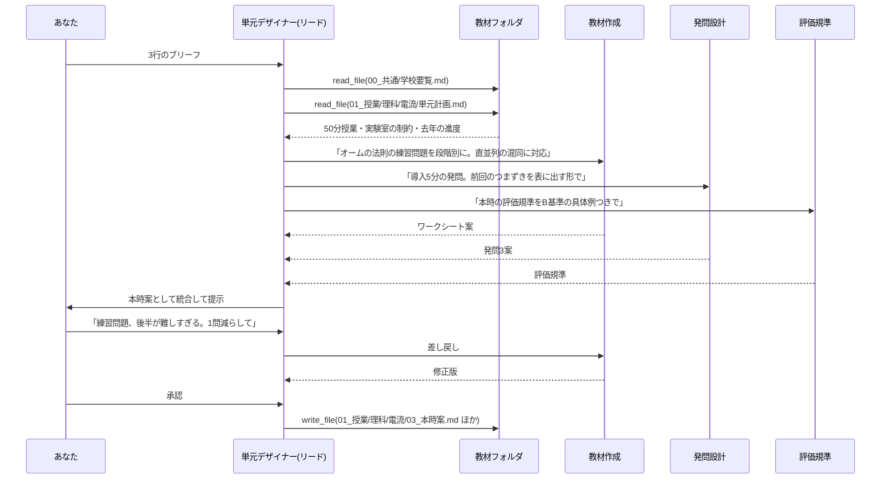

# 実際のワークフロー — 画面と手順でたどる

> [`teacher-edition-design.md`](./teacher-edition-design.md) の設計が、実際に使うとどう見えるかを分刻みで書いたものです。
> 例として **中学2年理科「電流とその利用」** を使いますが、教科・校種は差し替え可能です。
> 所要時間は、リード = Sonnet 5 / サブ = Haiku 4.5 で 4 エージェントを動かした場合の目安です。

---

## 場面 0 — 最初の 1 回だけやる準備（20 分）

一度やれば以後は不要です。ここを飛ばすと毎回同じ説明を書く羽目になるので、実質ここが本体とも言えます。

### 1. フォルダを作る

```
D:\kyouin\
  00_共通\
  01_授業\理科\
  03_おたより\
  99_記憶\
```

### 2. `00_共通` に 3 つだけファイルを置く

**`学校要覧.md`**（5 分で書ける分量で十分）

```markdown
# 勤務校の基本情報
- 中学校 / 各学年3クラス / 1クラス32〜35人
- 1コマ50分。理科は週4時間（うち1時間は実験）
- 実験室は2つ。予約制で、木曜は1年生が優先
- ICT: 生徒1人1台Chromebook。プロジェクタは各教室にあり
```

**`年間指導計画.md`**（既存のものをコピペで可）

**`書式\学級通信.md`**（去年の号を1つ貼るだけ。文体の見本になる）

### 3. ブリッジを起動するショートカットを作る

デスクトップに 1 つ。中身は `npm run bridge -- --root "D:\kyouin"` を実行するだけのバッチです。以後は**ダブルクリック 1 回**。

### 4. API キーを貼る

アプリの設定画面に一度貼れば、以降は保存されます。

---

## 場面 1 — 明日の 1 時間分をつくる（**実働 7 分**）

金曜の夕方、明日の 3 時間目の準備をする、という場面です。

| 時刻 | あなたがすること | 画面で起きること |
|---|---|---|
| 0:00 | ショートカットをダブルクリック | ブラウザが開き、3D の職員室が表示される。席に 4 人 |
| 0:15 | 「授業準備室」を選ぶ | チームが着席する |
| 0:30 | 入力欄に 3 行書いて Enter | 単元デザイナー（リード）が立ち上がる |
| 0:40 | — | リードが `01_授業/理科/` を読みに行く（去年の単元計画を発見） |
| 1:00 | — | リードが 3 つのタスクをカンバンに置き、3 人が自席に移動して作業を始める |
| 3:00 | — | 3 人が順に完了。リードが統合を始める |
| 3:30 | 出てきたものを読む | レビュー画面に 3 点（本時案・ワークシート・評価規準）が並ぶ |
| 4:00 | 1 か所だけ差し戻す | 担当が座り直して直す |
| 5:30 | 承認 | フォルダに保存され、印刷用の画面が開く |
| 6:00 | 印刷、教科書のページを確認 | — |

### 実際に打ち込む 3 行

```
2年「電流とその利用」の3時間目。オームの法則の練習。
前回、直列と並列がごちゃごちゃになっている生徒が多かった。
50分。ワークシート1枚と、最初の5分の導入発問がほしい。
```

これだけです。学校の情報も、去年の教材も、書式も、`00_共通` と `01_授業` にあるので書く必要がありません。

### 内部で何が起きているか



### 出てくるものの実物イメージ

`03_本時案.md`（冒頭）

```markdown
# 第3時 オームの法則の練習
## 本時の目標
直列・並列回路において、オームの法則を用いて電流・電圧・抵抗を求めることができる。

## 展開
| 時間 | 学習活動 | 指導上の留意点 |
|---|---|---|
| 5分 | 導入発問「同じ電球2個。明るく光るのはどっち?」 | 前時の混同を意図的に表面化させる。挙手で分布を見る |
| 10分 | 直列回路の練習(問1〜3) | 式の前に回路図に電流の値を書き込ませる |
| 15分 | 並列回路の練習(問4〜6) | 枝分かれの前後で電流が保存されることを図で確認 |
...
```

`03_ワークシート.md`（冒頭）

```markdown
## 1. ウォームアップ — 回路図に書き込もう
次の回路について、わかっている値を図に書き込みなさい。
(1) 電源6V、抵抗3Ωが1個の回路。流れる電流は □ A
...
```

### 保存されるファイル

```
D:\kyouin\01_授業\理科\電流とその利用\
  03_本時案.md          ← 新規
  03_ワークシート.md     ← 新規
  03_評価規準.md         ← 新規
  03_ワークシート.html   ← 印刷用
```

### あなたが必ずやること（自動化しない部分）

- 教科書の該当ページと突き合わせる（用語や記号の表記が教科書と揃っているか）
- 学級の実態に合わせて分量を削る
- 印刷して配る

---

## 場面 2 — 去年の教材を今年度版に直す（**実働 3 分**）

実際に一番使うのはおそらくこれです。ゼロから作るより、去年の自分の教材を直すほうが実作業に近いためです。

チームは「教材リフォーム室」を選び、こう書きます。

```
01_授業/理科/電流とその利用 を今年度版にして。
今年は3学期に移動したので、行事の谷間に入る。
去年、実験の指示が細かすぎて時間が足りなかった。
```

内部では、改訂担当が去年のフォルダを丸ごと読み、差分抽出担当が「時期の移動によって影響を受ける箇所」を洗い出し、整合チェック担当が時数の合計と年間指導計画との矛盾を見ます。

**去年のファイルは書き換えません。** `2026年度\` 配下に新規作成し、変更点の一覧を添えます。

```
変更点
- 第1時の導入を「乾電池の入手」→「体育祭の照明」に差し替え(3学期の話題に合わせた)
- 実験2の手順を8ステップ→5ステップに集約(所要12分の想定)
- 第5時と第6時を統合(年間計画で2時間削減が必要なため)
```

---

## 場面 3 — 学級通信を書く（**実働 4 分**）

```
今週の学級通信。書式は00_共通/書式/学級通信.md に合わせて。
・体育祭の練習が始まった
・掃除の取り組みが良くなってきた
・来週は保護者面談
```

書式ファイルを読ませているので、**去年のあなたの文体で**出てきます。ここが「AIっぽさ」を消す一番効く部分です。

個人情報は入れない前提なので、生徒名は入りません。名前を入れたい箇所は `〇〇さん` のまま出てくるので、印刷前に手で埋めます。

---

## 場面 4 — 週末に重いものを回す（選択肢 C の世界）

「2 学期の理科の単元計画を全部見直して、時数の辻褄を合わせて」——これは 5 分では終わりません。こういう作業は munder-difflin 側（Windows にインストールした本体）に投げて、**放っておく**のが向いています。

本命の設計（ブラウザ＋ブリッジ）は「今すぐ 1 つ作る」ための道具、munder-difflin は「時間はかかるが目を離してよい作業」のための道具、という住み分けです。**最初から両方を入れる必要はありません。**

---

## 3D の職員室は何のためにあるのか

正直に言えば、**機能ではなく進捗表示**です。ただし待ち時間の 3 分間、
- 誰が動いていて、誰が待っているか
- どこで止まっているか（承認待ちのエージェントは席で手を止める）

が一目でわかるので、「フリーズしたのか処理中なのか分からない」というストレスがありません。同じ情報はリスト表示でも見られます。

---

## 2 回目以降、入力が短くなる

`99_記憶/memory.md` にたまっていくものが効いてきます。

| 回数 | 打ち込む量 |
|---|---|
| 1 回目 | 3 行（単元・つまずき・ほしいもの） |
| 5 回目 | 2 行（「次の時間。前回の続きで」） |
| 20 回目 | 1 行（「4時。実験のまとめ」） |

`memory.md` の中身はこんなものです。

```markdown
- ワークシートは1枚に収める。裏面は使わない(印刷の都合)
- 「〜しよう」より「〜してみよう」を好む
- 実験の手順は5ステップまで。それ以上は時間が足りなくなる
- 評価規準はB基準の具体例を必ず添える
- 2年3組は進度がやや遅い
```

これは自動でたまるのではなく、**差し戻したときの指摘が記録されていく**仕組みです。同じ直しを 2 回すれば、3 回目からは最初からそうなります。

---

## 今のやり方との比較

| 作業 | 今 | この仕組み |
|---|---|---|
| 本時案 1 本 | 40〜60 分 | 7 分（うちあなたの実働 3 分） |
| ワークシート 1 枚 | 30 分 | 上に含まれる |
| 去年の教材の今年度版 | 20〜40 分 | 3 分 |
| 学級通信 1 号 | 30 分 | 4 分 |
| 文体を揃える | 毎回考える | 書式ファイルが担保 |
| 去年どうしたか思い出す | フォルダを漁る | エージェントが読む |

---

## この仕組みで「できないこと」

正直に列挙します。

- **生徒の解答の採点** — 個人情報を入れない前提なので対象外です
- **成績処理システムへの入力** — 校務支援システムには触れません
- **Word の細かいレイアウト** — 出るのは Markdown と印刷用 HTML です。凝った体裁は Word で仕上げてください
- **教科書の中身の参照** — 著作権上、本文は投入しません。単元名と扱う内容の指定までです
- **正しさの保証** — 指導要領の記述や数値を作ることがあります。`00_共通` に一次資料を置いて参照させ、最後はあなたが確認します

---

## 最小構成で始めるなら

場面 1 だけなら、**ブリッジすら要りません**（P0 の範囲）。チーム定義と日本語プロンプトを入れれば、ブラウザで作って画面からコピーする運用が今日から回せます。

フォルダを読ませる価値（場面 2 と、入力が短くなる効果）を実感したくなった時点で、ブリッジ（P1）に進むのが無理のない順序です。
