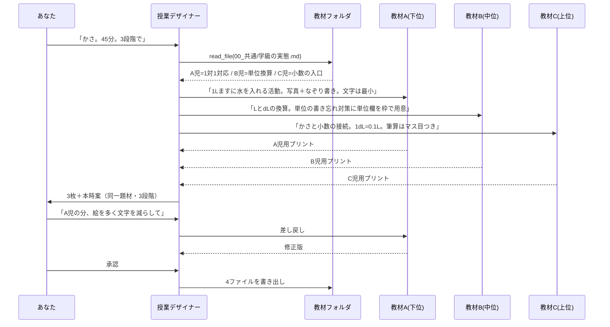

# 実際のワークフロー — 特別支援学級での使い方

> [`teacher-edition-design.md`](./teacher-edition-design.md) の設計が、実際に使うとどう見えるかを分刻みで書いたものです。
> 対象: **特別支援学級（全学年・全教科／重点は算数・国語・自立活動）**
> 所要時間は、リード = Sonnet 5 / サブ = Haiku 4.5 で 4 エージェントを動かした場合の目安です。

---

## なぜ特別支援学級でこそ効くのか

通常学級との決定的な違いは、**1 コマの中で児童ごとに違う教材が要る**ことです。同じ「かさ」の学習でも、A 児は 1 対 1 対応、B 児は L と dL の換算、C 児は小数の入り口、ということが同時に起きます。

つまり必要なのは「1 枚を速く作る道具」ではなく、**1 つの題材から難易度違いを何枚も同時に作る道具**です。これはマルチエージェント構成が最も素直に効く形で、通常学級向けよりも構造的に相性が良い用途です。

そしてもう一点。特支は**市販教材が使えない場面が多く、自作の比率が高い**——つまり生成の出番がそもそも多い。

---

## 場面 0 — 最初の 1 回だけやる準備（30 分）

ここが実質の本体です。特支の場合、置くファイルが通常学級と違います。

```
D:\kyouin\
  00_共通\
    学級の実態.md          ← ★ 最重要。匿名の児童プロフィール
    自立活動_区分項目.md    ← 6区分27項目の一次資料(文科省の告示から)
    年間指導計画\
    書式\
  01_教材\
    国語\  算数\  自立活動\
  02_個別\A児\ B児\ C児\ …  ← 匿名IDのみ
  03_印刷テンプレート\
  99_記憶\
```

### `00_共通/学級の実態.md`（これがすべての土台）

**氏名は書きません。** A 児・B 児という記号だけで運用します。氏名との対応表は紙か、このフォルダの**外**に置きます。こうしておけば、実態の記述をエージェントに渡しても個人情報の入力になりません。

```markdown
# 学級の実態（2026年度・6名）

## A児（1年）
- 国語: ひらがな清音は読める。拗音・促音が不安定。書くのは視写まで
- 算数: 10までの数唱と1対1対応。合成分解は5まで
- 集中: 10分。切り替えに予告が要る
- 有効な支援: 具体物、写真カード、1ページ1課題

## B児（3年）
- 国語: 2年相当。音読は流暢だが内容理解の設問で崩れる
- 算数: 繰り上がりのあるたし算。九九は2・5の段
- 特性: 見通しが持てないと不安が高まる。タイマー提示が有効

## C児（5年）
- 国語: 4年相当。漢字の書字に困難。読みは学年相当
- 算数: 小数の意味理解の入り口。筆算の桁ずれが多い
- 有効な支援: マス目つきの筆算用紙、ルビ

（以下 D児・E児・F児）
```

この 1 ファイルがあるだけで、以後「A 児は〜で」と説明する必要がなくなります。**毎回同じ説明を書かない**ことが、時間短縮の実体です。

### `00_共通/自立活動_区分項目.md`

自立活動の 6 区分 27 項目は、**告示の本文をコピーして置きます**。エージェントの記憶から書かせると項目名や区分がずれることがあるため、「このファイルの記述だけを引用して紐づける」とプロンプトで縛ります（設計側の実装項目 2）。

### `03_印刷テンプレート\`

特支では**レイアウトが教材の質そのもの**です。ここに CSS を数本置いておくと、書き出しの質が一段変わります。

| テンプレート | 中身 |
|---|---|
| `マス目.css` | 10マス／20マス原稿用紙、算数の筆算用マス |
| `なぞり書き.css` | 薄いグレー（#c8c8c8）の文字＋なぞり用の余白 |
| `分かち書き.css` | 文節間にスペース、行間 2.0 |
| `1課題1ページ.css` | 余白広め、1 ページ 1 課題、ページ番号なし |
| 共通 | **BIZ UDPゴシック**（Windows に標準搭載の UD フォント）を指定 |

---

## 場面 1 — 明日の算数を、児童 3 段階分つくる（**実働 8 分**）

特支で一番大きい負担がこれです。

### 打ち込む 3 行

```
明日の算数。題材は「かさ（LとdL）」。45分。
A児・B児・C児の3段階でプリントを作って。
B児は前回、単位の書き忘れが多かった。
```

学年も実態も書きません。`学級の実態.md` にあるからです。

### 何が起きるか

| 時刻 | 画面 |
|---|---|
| 0:20 | リード（授業デザイナー）が `学級の実態.md` と去年の `01_教材/算数/かさ/` を読む |
| 0:50 | カンバンに 3 タスク。**教材A・教材B・教材C の 3 人が同時に**動き出す |
| 3:00 | 3 枚が揃う。リードが「同じ題材で難易度だけが違う」ことを整合チェック |
| 3:30 | レビュー画面に 3 枚が横並びで出る |
| 5:00 | A 児の分だけ「絵を多く、文字を減らして」と差し戻し |
| 7:00 | 承認 → 3 枚 + 本時案が保存され、印刷用 HTML が開く |



### 出てくるもの

```
D:\kyouin\01_教材\算数\かさ\
  本時案_20260901.md
  A児_かさ.md  /  A児_かさ.html   ← なぞり書き＋1課題1ページ
  B児_かさ.md  /  B児_かさ.html   ← 単位欄を枠つきで用意
  C児_かさ.md  /  C児_かさ.html   ← マス目つき筆算
```

A 児用の冒頭はこんな具合です。

```markdown
## みずを 入れよう

1Lます に みずを 入れます。
（写真：1Lますと水）

□ いっぱいに なった          → 1L

れんしゅう：したの もじを なぞりましょう
   1 L      1 L      1 L
```

同じ題材で C 児用はこうなります。

```markdown
## かさと小数
1dL は 1L の 10 等分のうちの 1 つ分です。
1dL = 0.1L と表せます。

問1 3dL は何 L ですか。□.□ L
問2 1L2dL を L だけで表しなさい。
```

---

## 場面 2 — 国語の読み教材を、同じ話で 3 段階に落とす（**実働 5 分**）

```
「おおきなかぶ」で読みの教材。
A児は分かち書き＋絵。B児は音読用。C児は設問つきで。
```

- **リライト担当**が本文を分かち書き／ルビ付き／通常の 3 段階に
- **設問担当**が「誰が」「どうした」の 1 文抜き出しから、心情の推測まで段階を分けて作成
- **視覚支援担当**が場面絵の指示（イラスト素材の指定ではなく「ここに絵」の設計）

著作権の線は変わりません。**教科書本文をそのまま投入することはしません。** 著作権の切れた作品（昔話・古典）や、あなたの自作文であれば本文を扱えます。教科書教材については「単元名と扱う語彙・設問の型」までを指定して、本文は手元のものを使う運用になります。

---

## 場面 3 — 自立活動の指導案をつくる（**実働 6 分**）

特支固有で、かつ様式が重い作業です。

```
B児の自立活動。「見通しが持てず、活動の切り替えで不安が高まる」。
週2回、1回20分。1学期分の計画がほしい。
```

内部では、

- **区分項目の紐づけ担当**が `自立活動_区分項目.md` を読み、「心理的な安定 (2) 状況の理解と変化への対応」等に紐づけ（**ファイルの記述からのみ引用**）
- **活動案担当**が 20 分 × 週 2 回 × 12 週の活動案を段階的に
- **記録様式担当**が、毎回の記録が 1 分で書ける様式（チェック＋一言欄）を作成

出力は `02_個別\B児\自立活動_1学期.md` に保存されます。**個別の指導計画そのものではなく、その下書き**という位置づけです。様式への転記と最終判断はあなたがやります。

---

## 場面 4 — 学期末の記録を下書きする（**実働 10 分／6 名分**）

```
1学期の評価の下書き。02_個別 の各フォルダにある記録から。
様式は 00_共通/書式/個別の指導計画.md に合わせて。
```

匿名 ID のまま、6 名分の文案が出ます。あなたは実名の様式に転記しながら、実感と違う部分を直します。**評価の確定は人間だけがやる**——これは前提が変わっても動かしません。

---

## 場面 5 — 計算プリントの量産は、AI にやらせない

正直な話をします。

「繰り上がりのあるたし算を、数字違いで 20 枚」——これは **LLM に毎回作らせるべきではありません**。理由は 3 つ。

1. 遅い（20 枚分の生成を待つ）
2. 高い（毎回課金される）
3. **間違える**（答えの計算ミスが混じる）

正解は、**LLM に「問題の型」を 1 回作らせ、量産はスクリプトでやる**ことです。

```
LLM が作るもの: 型（繰り上がりが1回だけ／被加数は2桁／答えは20以下）＋レイアウト
スクリプトが作るもの: 数値の組み合わせ20通り＋答え（乱数＋検算）
```

ブリッジに `POST /generate/drill` を 1 本足せば、型を渡すと 20 枚が一瞬で、しかも**答えが確実に合った状態**で出ます。特支は反復練習の分量が多いので、ここは効きます。

**この線引きは設計の一部です**：文章・構成・段階づけは LLM、数値の量産と正誤は決定的なコード。

---

## 全学年・全教科をどう捌くか

「全教科ある」ことへの対処は、チームを増やすことではなく **`01_教材` に溜めること**です。

- 1 年目: ほぼ毎回ゼロから作る（それでも 1 枚 8 分）
- 2 年目: 去年のフォルダを読ませて「今年の A 児に合わせて」で 3 分
- 3 年目: 蓄積した教材の組み替えが中心になる

特支は児童が変わると実態が総入れ替えになりますが、**教材そのものは残ります**。「1 対 1 対応の教材」「単位換算の教材」という形で難易度別に溜まっていくので、次の年は `学級の実態.md` を書き換えるだけで再利用できます。これが 3 年目以降に効いてきます。

---

## 2 回目以降、入力が短くなる

`99_記憶/memory.md` にはこう溜まります。

```markdown
- プリントは必ず1枚に収める。裏面は使わない
- A児の教材は文字より写真・イラストを優先。1ページ1課題を厳守
- 算数の筆算は必ずマス目つき（C児の桁ずれ対策）
- 指示文は「〜しよう」ではなく「〜します」（B児が疑問形で混乱する）
- 自立活動の区分は必ず 00_共通/自立活動_区分項目.md から引用する
```

自動で溜まるのではなく、**差し戻したときの指摘が記録されていきます**。同じ直しを 2 回すれば、3 回目からは最初からそうなります。

---

## 費用

3 段階分の生成は 1 枚の約 1.5 倍。1 授業あたり **70〜90 円**、月 30 授業で **2,000〜3,000 円**程度（リード Sonnet 5 ＋ サブ Haiku 4.5、1 ドル 150 円換算）。計算プリントの量産をスクリプト側に寄せると、ここからさらに下がります。

---

## この仕組みで「できないこと」

- **児童の氏名を含む処理** — 匿名 ID 運用が前提です。氏名との対応はあなたの頭か紙の中
- **生徒の解答の採点** — 同上の理由で対象外
- **個別の指導計画の確定** — 出るのは下書き。様式への転記と判断は人間
- **教科書本文の扱い** — 単元名と設問の型まで。本文は手元のものを使う
- **イラスト素材そのもの** — 「ここに絵」の設計までで、絵は手持ちの素材集から。画像生成を使う場合は Gemini 側の機能になります
- **正しさの保証** — 自立活動の区分名や指導要領の記述を作ることがあります。一次資料を `00_共通` に置いて参照させ、最後はあなたが確認します

---

## 始め方

**場面 1 だけならブリッジ不要で今日から動きます**（P0 ＝ チーム定義と日本語プロンプト、週末 1 回分）。`学級の実態.md` を画面に貼り付ける運用でも、3 段階生成は成立します。

貼り付けが面倒になった時点（＝価値が確認できた時点）で、フォルダを読ませるブリッジ（P1）に進むのが、無理のない順序です。
